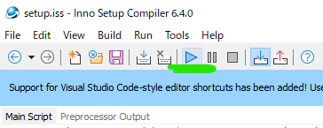

# uDesktopMascot

[](https://unity.com/releases/editor/archive)
[](https://github.com/MidraLab/uDesktopMascot/releases)
[](https://github.com/MidraLab/uDesktopMascot/actions/workflows/edit-test.yml)

Japanese | [English](README_EN.md) | [中文](README_CN.md) | [Español](README_ES.md) | [Français](README_FR.md)

**Note**: The above languages (English, 中文, Español, Français) are generated through automated translation by GPT-4o-mini. For accuracy and nuances, please refer to the original text (Japanese).

<!-- TOC -->
* [uDesktopMascot](#udesktopmascot)
  * [Overview](#overview)
  * [Feature List](#feature-list)
  * [Running on macOS](#running-on-macos)
  * [Requirements](#requirements)
  * [License](#license)
  * [Materials](#materials)
  * [How to create an installer](#how-to-create-an-installer)
    * [Windows](#windows)
    * [macOS](#macos)
  * [Creator Credits](#creator-credits)
  * [3rd Party Notices](#3rd-party-notices)
  * [Sponsor](#sponsor)
<!-- TOC -->

## Overview

"uDesktopMascot" is an open-source project for a desktop mascot application with the theme of `liberating creativity`.
One example of its functionality is loading models in VRM or GLB/FBX formats and displaying them on the desktop. Users can also freely set the colors of the GUI, such as the menu screen and application window, as well as the background image.
For a detailed list of features, please refer to [Feature List](#feature-list).


**Supported Platforms**
* Windows 10/11
* macOS

## Feature List

The application includes the following features. For more details, please refer to the list below.

Adding external assets can be achieved by placing them in the StreamingAssets folder.

<details>

<summary>Models and Animations</summary>

* Displays any model files placed in StreamingAssets.
  * Supports VRM (1.x, 0.x) format models.
  * Supports GLB/GLTF format models. (Animations are not supported)
  * Supports FBX format models. (However, some models may not load textures correctly, and animations are not supported)
    * Textures can be loaded by placing them in StreamingAssets/textures/.
* You can add VRM character models from the model addition screen.
  * Add the path to the VRM.
  * Select files from a file dialog.

</details>

<details>

<summary>Voice and BGM</summary>

* Loads and plays audio files placed in SteamingAssets/Voice/. If there are multiple files, they are played randomly.
  * Audio played on click is loaded from audio files placed in StreamingAssets/Voice/Click/.
* Loads and plays music files placed in SteamingAssets/BGM/. If there are multiple files, they are played randomly.
* Default voice for the character:
  * The default voice uses audio from [COEIROINK: Tsukuyomi-chan](https://coeiroink.com/character/audio-character/tsukuyomi-chan).
  * Played at app startup, app exit, and on click.

</details>

<details>

<summary>Application Settings via Text File</summary>

You can change the application's settings using the application_settings.txt file.

The structure of the settings file is as follows:

```txt
[Character]
ModelPath=default.vrm
TexturePaths=test.png
Scale=3
PositionX=0
PositionY=0
PositionZ=0
RotationX=0
RotationY=0
RotationZ=0

[Sound]
VoiceVolume=1
BGMVolume=0.5
SEVolume=1

[Display]
Opacity=1
AlwaysOnTop=True

[Performance]
TargetFrameRate=60
QualityLevel=2
```

</details>

<details>

<summary>Menu Screen</summary>

* You can set the background image and background color of the menu screen.
  * The background image can be loaded from image files placed in StreamingAssets/Menu/. The supported image formats are:
    * PNG
    * JPG (JPEG)
    * BMP
    * GIF (still image)
    * TGA
    * TIFF
  * The background color can be specified using a color code.

The following features are available from the menu:
* Add/Change models
* Change app settings
* Exit the app
* (Windows only) Minimize the app to the notification area: You can minimize the app.
  * When the app is minimized to the notification area, the app icon displayed on the desktop will appear in the notification area.
  * You can display the app on the desktop by clicking the notification area icon.
* AI Chat Feature: You can utilize the AI chat feature.
  * Local model support using the Qwen2 model.

</details>

## Running on macOS

When running the application on macOS, the app may be blocked by GateKeeper.
In that case, please execute the following command from the terminal.

```sh
xattr -r -c uDesktopMascot.app
```

## Requirements
* Unity 6000.0.31f1 (IL2CPP)

## License
* The code is licensed under the [Apache License 2.0](LICENSE).
* The following assets are licensed under [CC BY-NC 4.0](https://creativecommons.org/licenses/by-nc/4.0/).
  * BGM
  * Models

## Materials
* The default character animations were created using [the VRM Doll Play Animation Data Set](https://fumi2kick.booth.pm/items/1655686). It has been confirmed that it can be included and distributed in the repository.
* The font used is [Noto Sans Japanese](https://fonts.google.com/noto/specimen/Noto+Sans+JP?lang=ja_Jpan). The Noto Sans JP font is redistributed under the [SIL OPEN FONT LICENSE Version 1.1](https://fonts.google.com/noto/specimen/Noto+Sans+JP/license?lang=ja_Jpan). The copyright for the font is held by the original author (Google).
* The default voice uses audio from [COEIROINK: Tsukuyomi-chan](https://coeiroink.com/character/audio-character/tsukuyomi-chan). Usage has been confirmed with COEIROINK in advance.
* The button icons use [MingCute](https://github.com/MidraLab/MingCute).

## How to create an installer
### Windows
* Build the project in Unity to a folder named `uDesktopMascot` inside the `build` folder.

* Install [Inno Setup](https://www.jrsoftware.org/isdl.php).
  
* Once opened, click `More files` and select `setup.iss` found in your project directory.
  

* After selection, click the play button.
  

* Once the build is complete, the installer will be generated in the Root of the project.

### macOS
The installer can only be created on a macOS PC.

* Build the project in Unity to a folder named `uDesktopMascot` inside the `build` folder.

* Execute the following command.
```sh
cd build
productbuild --component uDesktopMascot/uDesktopMascot.app /Applications ./uDesktopMascot_mac_installer.pkg
```
* Once the build is complete, `uDesktopMascot_mac_installer.pkg` will be generated in the `build` folder.

## Creator Credits
* Models: "Aozora"
* BGM: MidraLab (eisuke)
* Software Icon: Yamucha

## 3rd Party Notices

See [NOTICE](./NOTICE.md).

## Sponsor
- Luna
- uezo