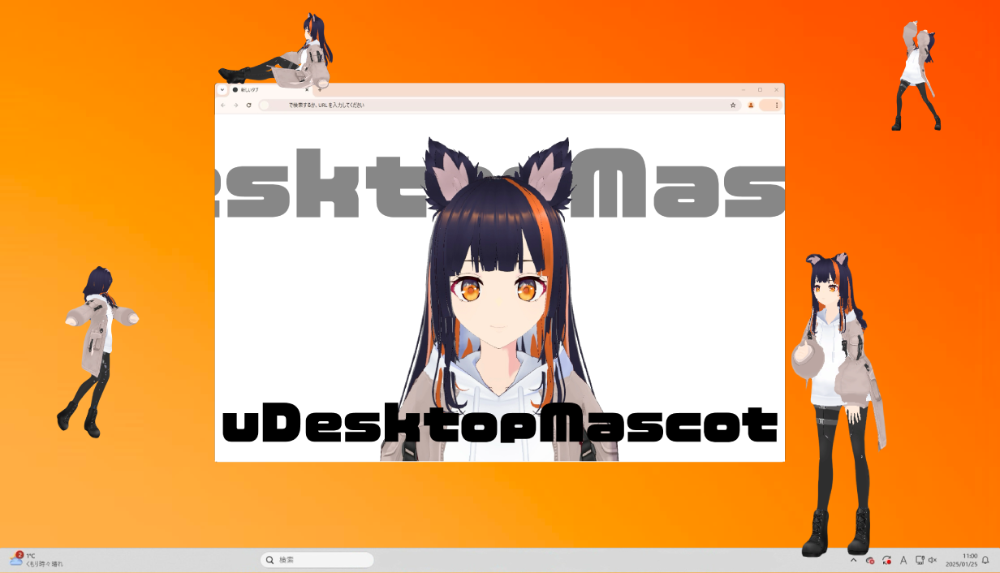

# uDesktopMascot

[](https://unity.com/releases/editor/archive)
[](https://github.com/MidraLab/uDesktopMascot/releases)
[](https://github.com/MidraLab/uDesktopMascot/actions/workflows/edit-test.yml)

日本語 | [English](README_EN.md) | [中文](README_CN.md) | [Español](README_ES.md) | [Français](README_FR.md)

**Nota**: Los idiomas mencionados anteriormente (English, 中文, Español, Français) han sido generados mediante traducción automática por GPT-4o-mini. Se recomienda consultar el texto original (日本語) para obtener precisión y matices en la traducción.

<!-- TOC -->
* [uDesktopMascot](#udesktopmascot)
  * [Descripción](#descripción)
  * [Lista de funciones](#lista-de-funciones)
  * [Ejecutando en macOS](#ejecutando-en-macos)
  * [Requisitos](#requisitos)
  * [Licencia](#licencia)
  * [Materiales](#materiales)
  * [Método de creación del instalador](#método-de-creación-del-instalador)
    * [Windows](#windows)
    * [macOS](#macos)
  * [Créditos de los creadores](#créditos-de-los-creadores)
  * [Avisos de terceros](#avisos-de-terceros)
  * [Patrocinadores](#patrocinadores)
<!-- TOC -->

## Descripción

"uDesktopMascot" es un proyecto de código abierto para una aplicación de mascota de escritorio, bajo el tema de `libertad creativa`.
Una de las funciones es la capacidad de cargar modelos en formatos VRM o GLB/FBX y mostrarlos en el escritorio. También puedes personalizar los colores de la GUI, como el menú y las ventanas de la aplicación. Para una lista más detallada de funciones, consulta la [lista de funciones](#lista-de-funciones).



**Plataformas compatibles**
* Windows 10/11
* macOS

## Lista de funciones

La aplicación incluye las siguientes funciones. Consulta la lista a continuación para más detalles.

La adición de activos externos se puede lograr colocando archivos en la carpeta StreamingAssets.

<details>

<summary>Modelos y Animaciones</summary>

* Carga y muestra archivos de modelo arbitrarios ubicados en StreamingAssets.
  * Se admiten modelos en formato VRM (1.x, 0.x).
  * Se admiten modelos en formato GLB/GLTF. (No se admite la animación)
  * Se admiten modelos en formato FBX. (Sin embargo, algunos modelos pueden tener problemas para cargar texturas. También, la animación no es compatible).
    * Las texturas se pueden cargar colocando los archivos en StreamingAssets/textures/.
* Adición de modelos VRM desde la pantalla de selección y adición de modelos:
  * Adición especificando la ruta.
  * Adición desde el cuadro de diálogo de selección de archivos.

</details>

<details>

<summary>Voz y BGM</summary>

* Carga y reproduce archivos de audio ubicados en StreamingAssets/Voice/. Si hay varios, se reproducen aleatoriamente.
  * Los sonidos que se reproducen al hacer clic son cargados desde los archivos de audio ubicados en StreamingAssets/Voice/Click/.
* Carga y reproduce archivos de música ubicados en StreamingAssets/BGM/. Si hay varios, se reproducen aleatoriamente.
* Adición de una voz predeterminada para los personajes:
  * La voz predeterminada utiliza audio de [COEIROINK: Tsukuyomi-chan](https://coeiroink.com/character/audio-character/tsukuyomi-chan).
  * Se reproduce al iniciar la aplicación, al cerrarla y al hacer clic.

</details>

<details>

<summary>Configuración de la aplicación mediante archivo de texto</summary>
Puedes cambiar la configuración de la aplicación mediante el archivo application_settings.txt.

La estructura del archivo de configuración es la siguiente:

```txt
[Character]
ModelPath=default.vrm
TexturePaths=test.png
Scale=3
PositionX=0
PositionY=0
PositionZ=0
RotationX=0
RotationY=0
RotationZ=0

[Sound]
VoiceVolume=1
BGMVolume=0.5
SEVolume=1

[Display]
Opacity=1
AlwaysOnTop=True

[Performance]
TargetFrameRate=60
QualityLevel=2
```

</details>

<details>

<summary>Pantalla del menú</summary>

* Puedes configurar la imagen de fondo y el color de fondo de la pantalla del menú.
  * La imagen de fondo se puede cargar desde archivos de imagen ubicados en StreamingAssets/Menu/. Los formatos de imagen compatibles son los siguientes:
    * PNG
    * JPG (JPEG)
    * BMP
    * GIF (imagen estática)
    * TGA
    * TIFF
  * Puedes especificar un código de color para el color de fondo.
* Desde la pantalla del menú, puedes acceder a las siguientes funciones:
  * Pantalla de selección y adición de modelos.
  * Función de chat AI.
  * Función LocalWeb.
  * Configuración de la aplicación.
  * Cierre de la aplicación.
* Al presionar el botón de minimización en la pantalla del menú, puedes minimizar la aplicación en el área de notificaciones solo en Windows.
  * La aplicación minimizada se puede volver a mostrar haciendo clic en el icono del área de notificaciones.

</details>

## Ejecutando en macOS

Al ejecutar la aplicación en macOS, puede que GateKeeper bloquee la aplicación.
En tal caso, ejecuta el siguiente comando desde la terminal:

```sh
xattr -r -c uDesktopMascot.app
```

## Requisitos
* Unity 6000.0.31f1 (IL2CPP)

## Licencia
* El código está bajo la [Licencia Apache 2.0](LICENSE).
* Los siguientes activos están licenciados bajo [CC BY-NC 4.0](https://creativecommons.org/licenses/by-nc/4.0/):
  * BGM
  * Modelos

## Materiales
* La animación predeterminada del personaje se ha creado utilizando el [“Paquete de datos de animación para juegos de muñecas VRM”](https://fumi2kick.booth.pm/items/1655686). Se ha confirmado la distribución de estos en el repositorio.
* La fuente es [Noto Sans Japanese](https://fonts.google.com/noto/specimen/Noto+Sans+JP?lang=ja_Jpan). Esta fuente se redistribuye bajo la [SIL OPEN FONT LICENSE Versión 1.1](https://fonts.google.com/noto/specimen/Noto+Sans+JP/license?lang=ja_Jpan). Los derechos de autor de la fuente pertenecen al autor original (Google).
* La voz predeterminada utiliza audio de [COEIROINK: Tsukuyomi-chan](https://coeiroink.com/character/audio-character/tsukuyomi-chan). Se ha confirmado previamente con COEIROINK sobre el uso de este.
* Los iconos de los botones utilizan [MingCute](https://github.com/MidraLab/MingCute).

## Método de creación del instalador
### Windows
* Compila en Unity en una carpeta llamada `uDesktopMascot` en la carpeta `build`.

* Instala [Inno Setup](https://www.jrsoftware.org/isdl.php).
  
* Ábrelo, haz clic en `More files` y selecciona `setup.iss` que se encuentra en el proyecto.
  

* Una vez seleccionado, haz clic en el botón de reproducción.
  

* Una vez finalizada la compilación, se generará el instalador en la raíz del proyecto.

### macOS
Solo se puede crear un instalador en una PC con macOS.

* Compila en Unity en una carpeta llamada `uDesktopMascot` en la carpeta `build`.

* Ejecuta el siguiente comando:
```sh
cd build
productbuild --component uDesktopMascot/uDesktopMascot.app /Applications ./uDesktopMascot_mac_installer.pkg
```
* Una vez finalizada la compilación, se generará `uDesktopMascot_mac_installer.pkg` en la carpeta `build`.

## Créditos de los creadores
* Modelos: "Aozora"
* BGM: MidraLab (eisuke)
* Icono de software: Yamucha

## Avisos de terceros

Consulta [NOTICE](./NOTICE.md).

## Patrocinadores
- Luna
- uezo